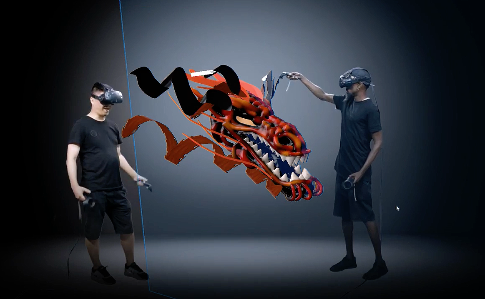

# Gestumtkunswerk Response
In the contemporary age of technology I think that Virtual Painting would be considered a Gesamtkunstwerk. 
This tool allows the user to create paintings in a 3 D space in real time using virtual assets. 
The inclusion of visual and auditory cues can give viewers a sense of immersion that extends beyond traditional painting. 
Media designed with the intent to engage with the senses in new ways will undoubtedly, create new platforms for artists as technology advances. Just as Wagner combined architecture, drama, acoutics, and lighting into his productions; Virtual Reality has the potenial to create new ways to entangle art and performance.
. 

! (https://www.youtube.com/watch?v=DafgiEcXr6c)
